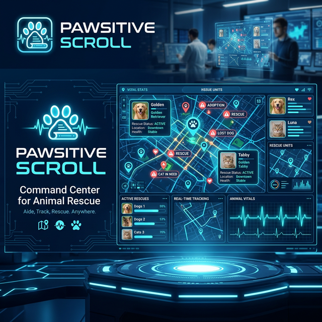
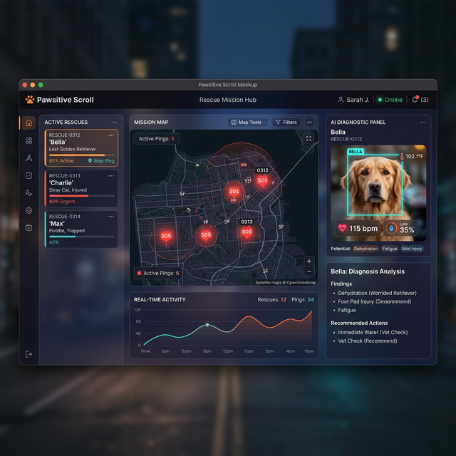
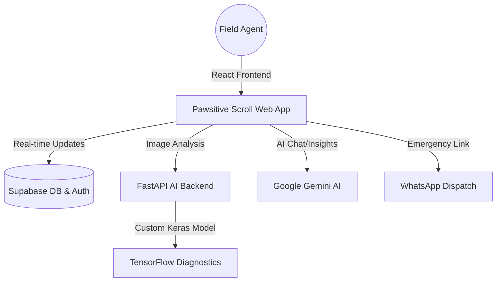

# 🐾 Pawsitive Scroll | Rescue Command Interface



[](https://pawstivescroll.vercel.app)
[](https://reactjs.org/)
[](https://fastapi.tiangolo.com/)
[](https://wwww.tensorflow.org/)
[](https://tailwindcss.com/)

**Pawsitive Scroll** is a modular, high-impact animal welfare ecosystem. It combines real-time data visualization, AI-powered diagnostics, and a decentralized logistics network to streamline animal rescue operations and facilitate community-driven welfare efforts.

🔗 **Live Deployment:** [pawstivescroll.vercel.app](https://pawstivescroll.vercel.app)

---

## 🏗️ System Architecture

Pawsitive Scroll follows a modern full-stack architecture designed for scalability and real-time responsiveness.





### 🔹 Components:
-   **Frontend**: A high-performance React application utilizing **Vite** for rapid builds and **Framer Motion** for a premium, glassmorphism-inspired UI.
-   **AI Engine**: Dual-layer AI integration:
    -   **Generative Intelligence**: Powered by **Google Gemini** for real-time situational analysis and user interaction.
    -   **Clinical Diagnostics**: A custom **TensorFlow/Keras** model served via **FastAPI** for specialized animal skin disease detection.
-   **Backend & Data**: **Supabase** handles the decentralized data layer, providing real-time PostgreSQL synchronization and secure authentication.
-   **Geospatial Layer**: **Leaflet.js** integration for tactical mapping of rescue missions and NGO locations.

---

## 🚀 Specialized Modules

-   **📡 Mission Hub**: A real-time intelligence feed for news, rescue updates, and adoption cases with global synchronization.
-   **🚁 Sector Grid**: Interactive live tactical map tracking distress signals (SOS) and active cases via satellite imagery.
-   **🧬 Bio-Scan ID**: AI-powered diagnostics to identify breeds and assess medical severity via neural networks.
-   **🏥 NGO Registry**: A verified database of animal welfare organizations with direct GPS navigation and emergency hotlines.
-   **📦 Supply Lines**: A decentralized logistics network to fund specific critical items like vaccines and food.
-   **🚨 SOS Beacon**: One-tap emergency link to broadcast GPS coordinates to national dispatch via WhatsApp.

---

## 🛠️ Tech Stack

### Frontend
-   **Framework**: React 19 + Vite
-   **Styling**: Tailwind CSS (Glassmorphism design system)
-   **State Management**: React Hooks & Supabase Real-time
-   **Maps**: Leaflet & React-Leaflet
-   **Animations**: Framer Motion
-   **Icons**: Lucide React

### Backend (AI Services)
-   **Framework**: FastAPI (Python)
-   **ML Engine**: TensorFlow 2.x / Keras
-   **Image Processing**: Pillow & NumPy
-   **Server**: Uvicorn

### Infrastructure
-   **Database**: Supabase (PostgreSQL)
-   **Hosting**: Vercel (Frontend)
-   **AI API**: Google Generative AI (Gemini)

---

## 📦 Installation & Setup

### 1. Frontend Setup
```bash
# Clone the repository
git clone https://github.com/priyanshukannaujiya/pawstivescroll.git
cd animal-welfare-app

# Install dependencies
npm install

# Set up environment variables (.env)
VITE_GEMINI_KEY=your_gemini_key
VITE_SUPABASE_URL=your_supabase_url
VITE_SUPABASE_ANON_KEY=your_supabase_key

# Run development server
npm run dev
```

### 2. Backend (AI) Setup
```bash
# Navigate to root
cd ..

# Install Python dependencies
pip install fastapi uvicorn tensorflow pillow numpy

# Start the AI server
python app.py
```

---

## 🛡️ Strategic SEO & UX
-   **Semantic HTML5**: Optimized for accessibility and search crawlers.
-   **Responsive Geometry**: Flawless experience across mobile, tablet, and ultra-wide displays.
-   **Performance**: Sub-second load times via Vite's ESM-based bundling.
-   **Tactical UI**: Dark-mode focused command center aesthetic for field usability.

---

## 🤝 Contribution Protocol

We welcome contributions from developers, designers, and animal welfare advocates.

1.  **Fork** the repository.
2.  **Branch**: `git checkout -b feat/YourFeature`
3.  **Commit**: `git commit -m 'Add strategic feature'`
4.  **Push**: `git push origin feat/YourFeature`
5.  **Merge**: Open a Pull Request.

---

## 📄 License
Distributed under the MIT License. Created with ❤️ for the Welfare of Animals.

**Lead Developer:** [Priyanshu Kannaujiya](https://github.com/priyanshukannaujiya)
